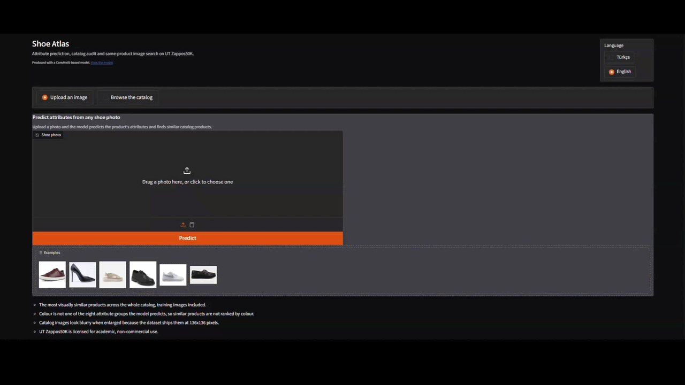

# Shoe Atlas

### 👟 [Try it live on Hugging Face](https://huggingface.co/spaces/AeonMuffinz/shoe-atlas)

Shoe Atlas looks at a product photo and works out eight things about the shoe: what kind it is, how high
the heel is, how it fastens, what it is made of, the shape of the toe, and a few more. It then uses those
predictions for two jobs. It checks a shop's own product data for mistakes, and it finds similar products
in the catalog.

Built on [UT Zappos50K](https://vision.cs.utexas.edu/projects/finegrained/utzap50k/), 50,025 shoe photos.
The interface is bilingual, Turkish by default.

<sub>A personal project built to do during my internship. It was never handed over to the company and
stayed a project. Not a commercial product, and the dataset is for academic use only.</sub>

## Upload a photo



Two things happen when you drop an image in.

**🏷️ It reads the attributes.** Eight groups of them, each with a confidence. Some are one of a kind,
like heel height, where a shoe has exactly one answer. Others can have several at once, like materials.
The model handles both, and the confidences shown are calibrated rather than raw model output.

**🔍 It finds similar products.** The photo is turned into a vector and matched against all 50,025
catalog images. Fine tuning on shoe attributes made this 2.6x better than the same network
untrained, and it beats CLIP.

## Check a catalog product

<!-- GIF 2: catalog mode -->

**🚩 It flags mistakes in the shop's own data.** Every online shop has products tagged wrong: the leather
boot filed as canvas, the three inch heel listed as flat. The model compares what it sees against what the
catalog claims, and marks each attribute as agreeing, disagreeing, or missing and worth filling in.

Those flags are tested rather than trusted. Clean data is deliberately corrupted by a known amount, the
model is retrained on it, and the audit is scored on how much of the planted damage it finds.

## Try it

You need [uv](https://docs.astral.sh/uv/) and the dataset.

```bash
uv sync
```

```bash
uv run python -m src.prepare_data
```

```bash
uv run python -m src.app
```

That opens the interface. Drop in a shoe photo, or pick a catalog product to see the audit.

To train and score the model yourself:

```bash
uv run python -m src.train --config configs/convnext_base_ar1.yaml
```

```bash
uv run python -m src.evaluate --run artifacts/runs/convnext_base_ar1_s42
```

## Results and method

Every run, how the model was selected, and what each measurement means:
**[docs/RESULTS.md](docs/RESULTS.md)**.
